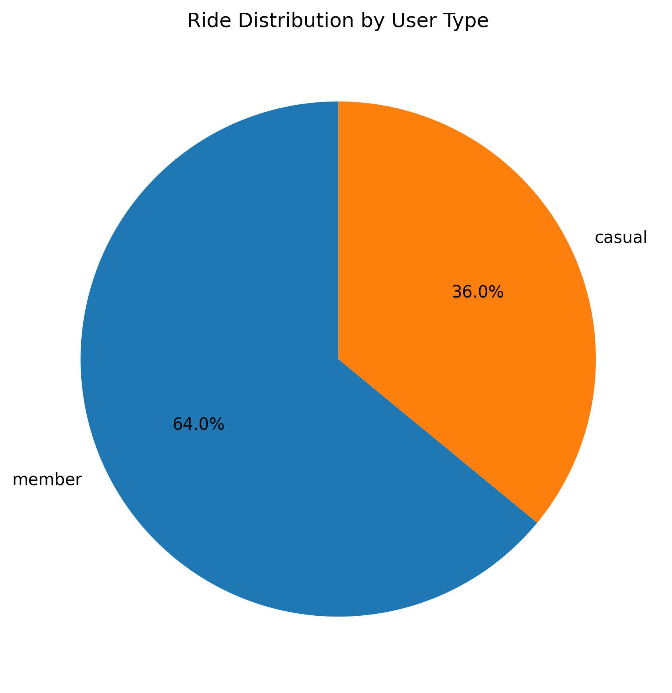
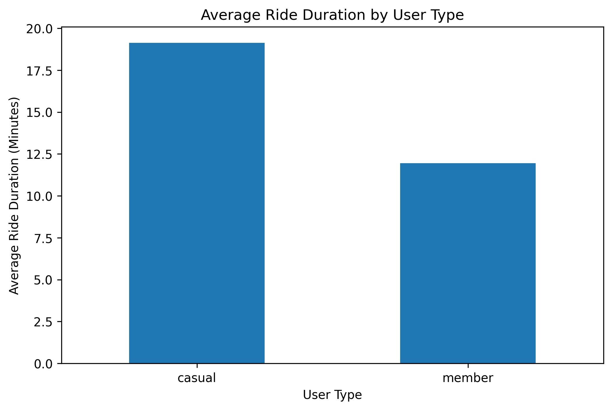
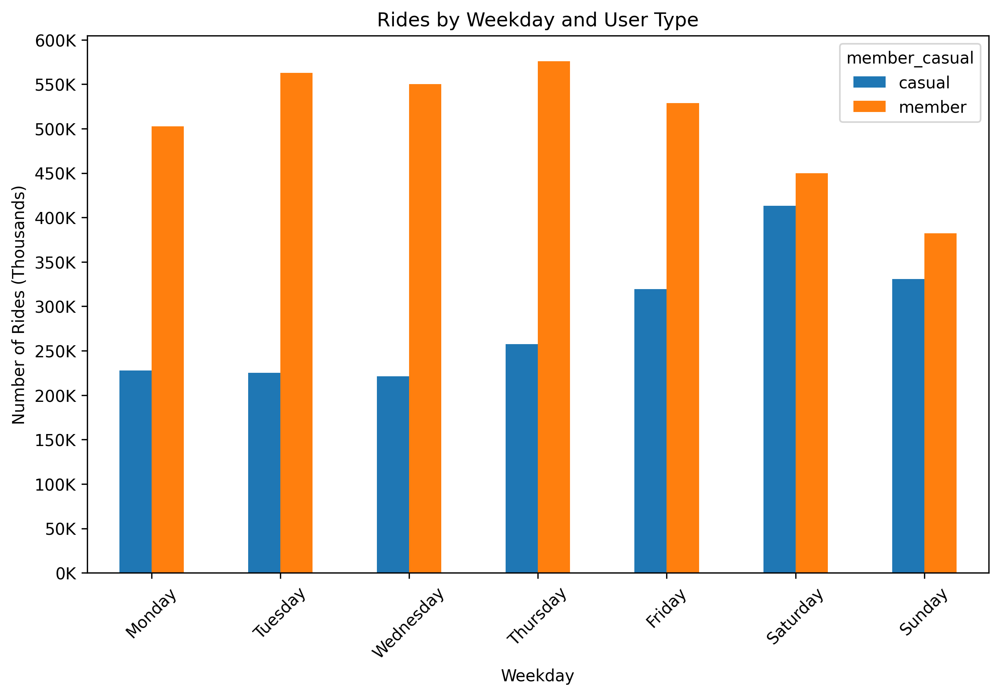
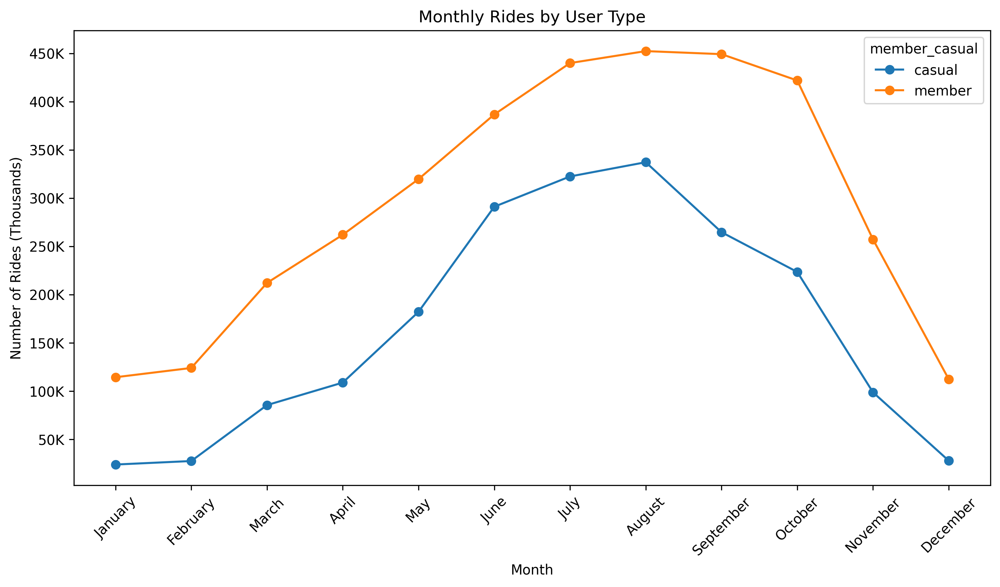
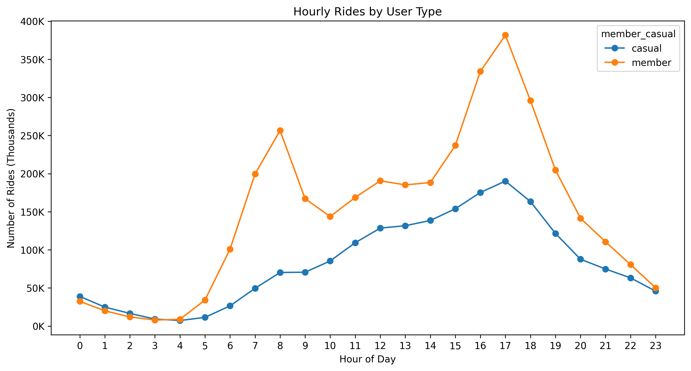
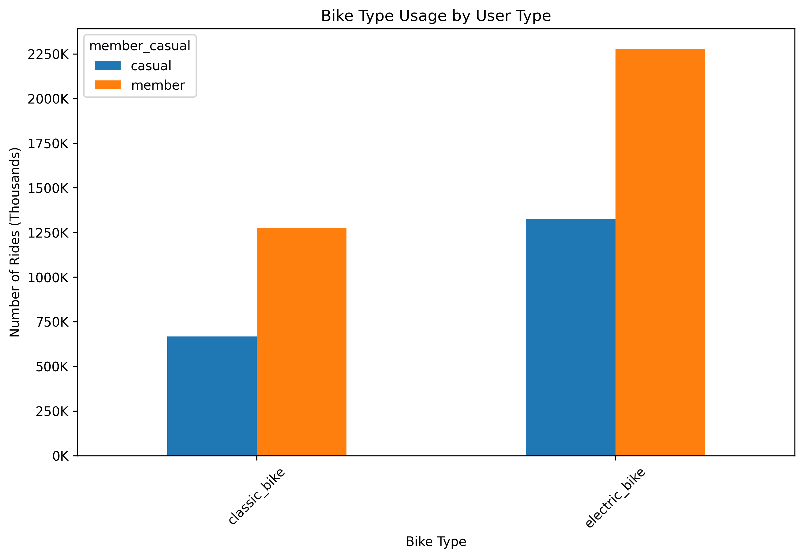

# Cyclistic Bike-Share Case Study

## Project Overview

This project analyzes Cyclistic bike-share trip data for the year 2025 using Python. The main objective is to understand how annual members and casual riders use Cyclistic bikes differently.

The analysis follows the data analysis process: ask, prepare, process, analyze, share, and act. The final goal is to generate data-driven insights that can support marketing strategies aimed at converting casual riders into annual members.

## Business Task

Cyclistic wants to increase the number of annual members. To support this goal, this analysis explores the differences between annual members and casual riders in terms of:

* Ride frequency
* Ride duration
* Weekday and weekend usage
* Monthly seasonality
* Hourly usage patterns
* Bike type preferences

The main business question is:

**How do annual members and casual riders use Cyclistic bikes differently?**

## Tools Used

* Python
* Google Colab
* Pandas
* NumPy
* Matplotlib
* Google Drive
* ChatGPT, used as a support tool for coding guidance, documentation, and project structure

## Use of AI Assistance

ChatGPT was used as a support tool during this project to help structure the Python workflow, review code logic, improve documentation, and refine the presentation of findings.

The data cleaning decisions, analysis interpretation, business recommendations, and final conclusions were reviewed and adapted by the project author.

AI assistance was used as a learning and productivity tool, while the analytical process and final project decisions remained under the author's responsibility.

## Dataset

The dataset used in this project comes from the public Divvy Trip Data repository:

[Divvy Trip Data](https://divvy-tripdata.s3.amazonaws.com/index.html)

The analysis uses monthly trip data files for the year 2025. Each CSV file represents one month of bike-share trips.

The dataset includes trip-level information such as:

* Ride ID
* Bike type
* Start and end timestamps
* Start and end station information
* Geographic coordinates
* User type: `member` or `casual`

The raw CSV files are not included in this repository because of their large file size. The analysis was completed in Google Colab using files stored in Google Drive.

## Data Source Acknowledgment

Data source: Divvy Trip Data.

The dataset was obtained from the public Divvy trip data repository and used for educational analysis as part of the Cyclistic bike-share case study.

## Project Structure

```text
cyclistic-bike-share-analysis/
│
├── README.md
├── cyclistic_bike_share_analysis.ipynb
├── outputs/
│   ├── ride_distribution_by_user_type.png
│   ├── average_ride_duration_by_user_type.png
│   ├── rides_by_weekday_and_user_type.png
│   ├── monthly_rides_by_user_type.png
│   ├── hourly_rides_by_user_type.png
│   └── bike_type_usage_by_user_type.png
│
└── .gitignore
```

## Notebook Structure

The notebook is organized as follows:

1. Introduction
2. Data Source
3. Notebook Structure
4. Use of AI Assistance
5. Load the Data
6. Combine Monthly Files
7. Initial Data Exploration
8. Save the Combined Dataset
9. Data Cleaning
10. Save the Clean Dataset
11. Exploratory Data Analysis
12. Save Analysis Outputs
13. Monthly and Hourly Usage Patterns
14. Bike Type Usage
15. Summary of Key Findings
16. Business Recommendations
17. Conclusion
18. Save Visualizations
19. Final Project Check
20. Project Completion

## Data Cleaning Process

The original monthly CSV files were combined into a single dataset. The cleaning process included:

* Converting date columns to datetime format
* Creating a ride duration variable in minutes
* Checking duplicate ride IDs
* Reviewing missing values
* Removing invalid trips
* Removing trips with zero or negative duration
* Removing trips longer than 24 hours
* Creating new time-based variables such as month, weekday, hour, and weekend status

After cleaning, the dataset contained **5,547,380 valid trips**. Only **5,614 records** were removed, representing approximately **0.1%** of the original dataset.

## Key Visualizations

### Ride Distribution by User Type



### Average Ride Duration by User Type



### Rides by Weekday and User Type



### Monthly Rides by User Type



### Hourly Rides by User Type



### Bike Type Usage by User Type



## Summary of Key Findings

The analysis shows clear behavioral differences between annual members and casual riders.

First, annual members accounted for most rides in 2025, with **3,552,569 rides**, representing **64.04%** of total trips. Casual riders completed **1,994,811 rides**, representing **35.96%** of total trips.

Second, casual riders took longer trips than annual members. Casual riders had an average ride duration of **19.13 minutes**, compared with **11.95 minutes** for members. The median ride duration also followed the same pattern, with casual riders recording longer trips than members.

Third, weekday usage patterns suggest that members use Cyclistic more consistently throughout the week, especially during weekdays. This may indicate routine-based transportation behavior, such as commuting or regular daily trips. Casual riders also use the service during weekdays, but their relative usage is stronger during weekends compared with members.

Fourth, monthly ride patterns show a strong seasonal trend. Both user groups increased bike usage during warmer months, especially between June and September. Casual riders reached their highest number of rides in August, while members recorded high usage in August, September, July, and October.

Fifth, hourly usage patterns suggest different trip purposes. Members show clear peaks around commuting hours, especially around 8:00 AM and between 4:00 PM and 6:00 PM. Casual riders peak mainly in the afternoon and early evening, especially between 2:00 PM and 6:00 PM, which may reflect leisure, tourism, errands, or occasional trips.

Finally, bike type usage does not appear to be the main difference between both groups. Both members and casual riders used electric bikes more frequently than classic bikes, with similar percentage distributions across user types.

## Business Recommendations

### 1. Launch seasonal membership campaigns during high-demand months

Casual rider activity increases strongly during warmer months, especially between June and September. Cyclistic could launch targeted membership campaigns before and during this period, highlighting the value of becoming an annual member for frequent summer riders.

### 2. Target casual riders during weekends and leisure-oriented trips

Casual riders show relatively stronger weekend usage compared with members and tend to take longer trips. Marketing campaigns could focus on users who ride on weekends, promoting annual memberships as a convenient and cost-effective option for regular leisure, tourism, or recreational trips.

### 3. Promote membership benefits during afternoon and early evening usage peaks

Casual riders are most active between 2:00 PM and 6:00 PM. Cyclistic could use in-app messages, email campaigns, or station-based promotions during these time windows to encourage casual riders to consider annual membership plans.

### 4. Create trial or flexible membership options for casual riders

Since casual riders may not immediately identify as daily commuters, Cyclistic could offer trial memberships, seasonal passes, or discounted first-month annual plans. This could reduce the barrier to conversion and help casual riders experience the benefits of membership.

### 5. Emphasize cost savings for frequent casual riders

Because casual riders take longer trips and may use bikes repeatedly during high-demand months, Cyclistic could personalize marketing messages showing how much frequent casual riders could save by switching to an annual membership.

## Conclusion

The analysis indicates that annual members and casual riders use Cyclistic bikes differently. Members appear to use the service more frequently and consistently, with patterns that suggest routine transportation and commuting behavior. Casual riders, on the other hand, tend to take longer trips and show stronger usage during warmer months, weekends, and afternoon hours.

These findings suggest that Cyclistic should focus its marketing strategy on casual riders who already show repeated or high-value usage patterns, especially during summer months, weekends, and afternoon periods. By targeting these users with seasonal campaigns, flexible membership options, and personalized cost-saving messages, Cyclistic may increase the conversion of casual riders into annual members.

## How to Run the Notebook

1. Open the notebook in Google Colab.
2. Mount Google Drive.
3. Download the monthly CSV files from the public Divvy Trip Data repository.
4. Store the raw monthly CSV files in a folder called `raw_data`.
5. Run the notebook from top to bottom.
6. The cleaned data, summary tables, and visualizations will be saved in the project folders.

## Notes

The raw data files used in this project were downloaded from the public Divvy Trip Data repository. They are not included in this GitHub repository because of their large file size.

This repository focuses on the analysis notebook, visual outputs, summary tables, and project documentation. The dataset belongs to Divvy/Cyclistic and is used here only for educational and portfolio purposes.
